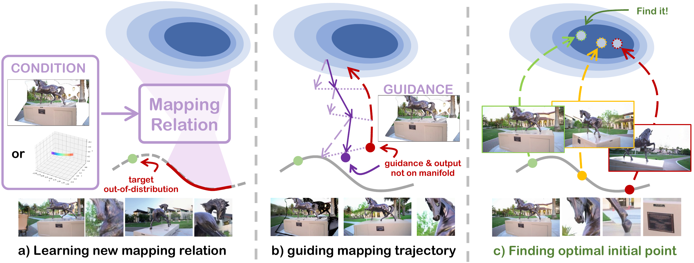

# NeoMap: Training-free Novel-View Synthesis from Single Images and Videos (ECCV 2026)

<h4 align="center">

[](./LICENSE)
[](https://arxiv.org/abs/2607.01962)
[](https://github.com/vLAR-group/NeoMap)

<p>
    
</p>

</h4>

This repository will contain the official implementation of the paper: *NeoMap: Training-free Novel-View Synthesis from Single Images and Videos*.
NeoMap is a training-free framework for novel-view video synthesis from single images or monocular videos. It locates high-fidelity, view-consistent novel-view solutions within the natural video data manifold learned by general pre-trained video models through convergent manifold alternating projection iterations.

Please feel free to contact us via [jinxi.li, tonax.zhang]@connect.polyu.hk or open an issue if you have any questions or suggestions.

<!--
## 📹 Demo

<p>
    
</p>
-->

## 📢 News

- **2026-07-02**: NeoMap is released on [arXiv](https://arxiv.org/abs/2607.01962).
- **2026-07-02**: NeoMap is accepted by ECCV 2026.

## 📋 TODO

- [x] Submit the paper onto arXiv.
- [x] Release the project repository.
- [ ] Release installation instructions.
- [ ] Release inference code.
- [ ] Release evaluation code.
- [ ] Release data and pretrained-model instructions.

<!--
## ⚙️ Installation

```shell script
git clone https://github.com/vLAR-group/NeoMap.git --recursive
cd NeoMap

# Environment setup will be released soon.
```
-->

<!--
## 🔑 Usage

Detailed inference and evaluation instructions will be released soon.

```shell script
# Example commands will be added here.
```
-->

<!--
## 💾 Datasets

Data preparation and benchmark instructions will be released soon.
-->

## 😊 Acknowledgement

We thank the authors of [FlexWorld](https://github.com/ML-GSAI/FlexWorld), [Wan2.2](https://github.com/Wan-Video/Wan2.2), [VGGT](https://github.com/facebookresearch/vggt), [Video Depth Anything](https://github.com/DepthAnything/Video-Depth-Anything), and [VIPE](https://github.com/nv-tlabs/vipe) for their open-source code and excellent work.

## 📚 Citation

If you find our work helpful, please consider citing:

```bibtex
@article{li2026neomap,
  title={NeoMap: Training-free Novel-View Synthesis from Single Images and Videos},
  author={Jinxi Li and Tianyi Zhang and Yafei Yang and Zihui Zhang and Peng Huang and Koon Wing Macgyver Lin and Bo Yang},
  journal={ECCV},
  year={2026}
}
```
